# greenbox OS - architecture

How the thing is put together. [README.md](README.md) covers *why* guests are
not firmware and what the programs do; this covers the machinery: who owns
what, what runs on which task, how a `.gbx` becomes running code, and what
happens when any of it fails. [TOOLCHAIN.md](TOOLCHAIN.md) covers what you need
installed to build any of it.

Target is one board: LILYGO TTGO T-Display, ESP32-D0WDQ6-V3, 4 MB flash,
520 KB SRAM, no PSRAM. Everything below assumes that hardware.

---

## 1. The shape of the system

Two kinds of code run on this board. The **OS** is one ordinary ESP-IDF
application, linked once, holding FreeRTOS, newlib, the SPI driver and the
panel init. **Guests** are relocatable blobs of a few kilobytes that contain
none of that and reach the hardware only through a table of function pointers.

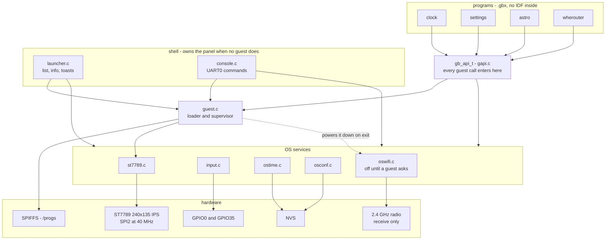

The important asymmetry: the shell talks to the services **directly**, guests
only through `gapi.c`. That indirection is not decoration - it is where the
syscall guard, the allocation tracking and the ABI boundary live.

`abi/greenbox_abi.h` is compiled into both sides and is the only header they
share. It pulls in nothing from ESP-IDF, which is what makes it compilable by a
bare `-nostdlib` cross-compile.

---

## 2. Boot

`app_main` does nothing but order things correctly, then hands its own task to
the launcher.

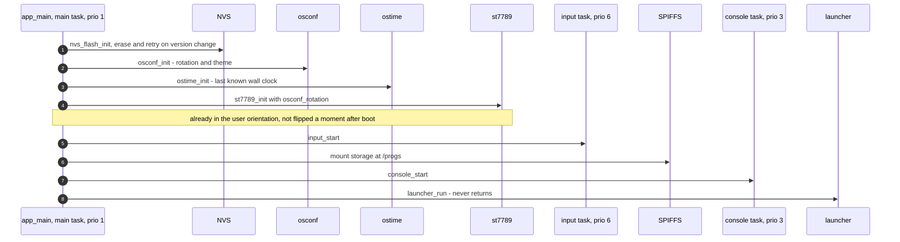

Each step is a precondition for the next: NVS before anything that persists,
settings before the panel because `st7789_init` takes the rotation, the panel
before the rest so a later failure can be shown rather than only logged, and
input before storage so the escape gesture works even if the mount wedges.

---

## 3. Tasks, and the one event queue

Four tasks. Priorities are chosen so the escape gesture always gets serviced.

| task | prio | stack | what it does |
|---|---|---|---|
| `input` | 6 | 2560 | samples both buttons every 10 ms |
| `<guest name>` | 4 | 4096 or from the header | the running program |
| `console` | 3 | 3072 | UART0 command line |
| `main` | 1 | 4096 | the launcher, after `app_main` falls into it |

There is exactly **one** event queue and exactly **one** reader of it at a
time: the launcher while nothing is running, the guest while something is.

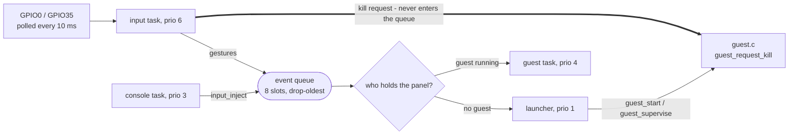

The thick edge is the point of the whole arrangement. A gesture that a guest
might never read cannot be delivered *through* the guest - so the kill request
goes straight from the input task into the loader, above both readers. A guest
that has stopped reading events still dies.

The queue drops its **oldest** entry when full rather than blocking. The input
task must never stall: it is the only thing that can rescue a wedged system.

Beside the queue there is `api->buttons()`, a live debounced bitmask. Events
say what gesture *happened*; nothing in an event stream says when a hold
*ends*, so anything that must move while a button is down and stop when it is
released - `astro` - reads state instead. Both exist because a menu needs the
first and a game needs the second.

---

## 4. Gestures

One state machine per button, driven at 10 ms.

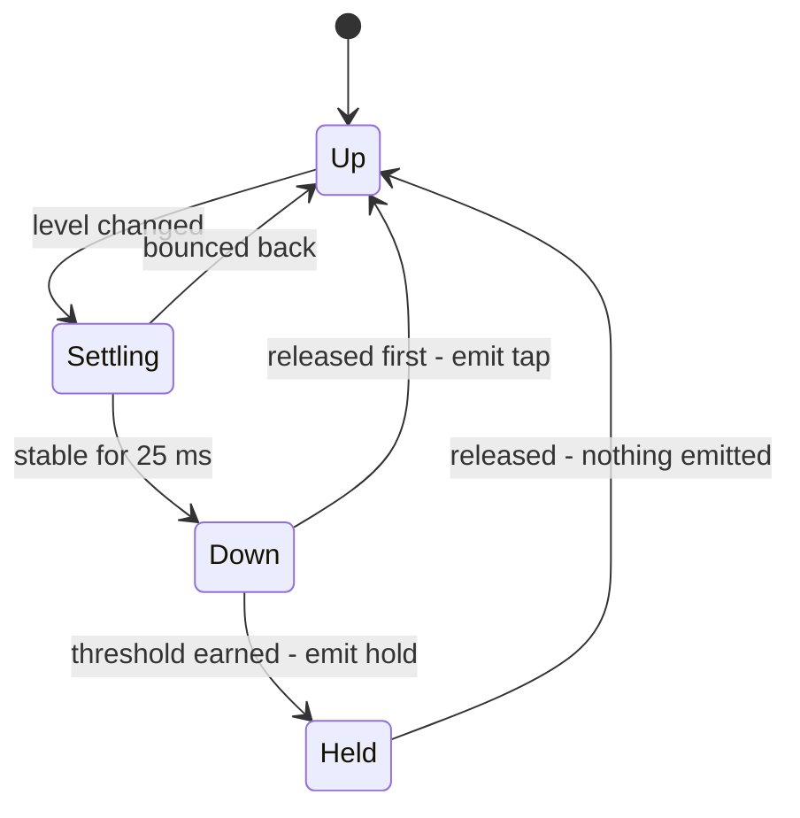

Both buttons fire their hold **on the earn**, not on the release, and the
latch then suppresses the release event.

| | threshold | emits | also does |
|---|---|---|---|
| left | 3000 ms | `GB_EV_L_SHORT` on tap, `GB_EV_L_LONG` on hold | hold **also** calls `guest_request_kill` |
| right | 1000 ms | `GB_EV_R_SHORT` on tap, `GB_EV_R_LONG` on hold | - |

The left hold is escape and kill in one gesture, which is why it can fire on
the earn at all. The earlier arrangement had escape at 450 ms and a separate
kill at 3 s, and at 450 ms the button could not yet tell one from the start of
the other - so it had to wait for the release to find out. Collapsing them
removed the question.

Order within that single pass matters: the event is emitted **before** the kill
request, so a guest parked in `wait_event` wakes with `L_LONG` and its grace
period rather than with the empty wake-up the kill injects.

The two thresholds differ on purpose. Three seconds is the price of destroying
something. Accept destroys nothing, so it charges one.

### The quit bar, and who owns those scanlines

One second into a left hold over a running guest, the input task starts drawing
a bar along the bottom of the panel and fills it over the remaining two. It
draws from the input task, under the same syscall guard a guest's own draws
take, with a bounded timeout rather than an indefinite wait - the input task
cannot be the thing that waits on a wedged guest.

Keeping it on screen is a separate problem from putting it there. A guest that
repaints its whole frame clears those rows continuously, and repainting the bar
in a loop against it is a race, not a fix. The OS reserves the strip instead:

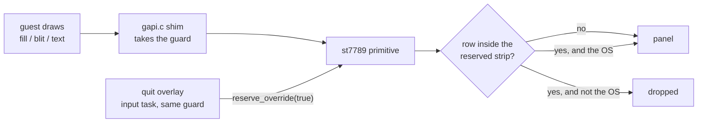

`st7789_reserve(rows)` clips every primitive in the driver to the panel above
the bottom `rows`; `st7789_reserve_override()` lifts the clip for the OS's own
painting pass. Both the guest's draws and the overlay's run under the syscall
guard, so the two can never be inside a primitive at once and the override flag
needs no lock of its own.

Guests are not told: `width()` and `height()` keep reporting the whole panel, so
nothing reflows when the strip appears and nothing has to be rewritten to
cooperate. The reservation is released when the hold ends and again by
`guest_supervise` when the guest exits - the second one matters, because a
launcher repainting into a still-reserved strip would keep a band of the dead
guest's last frame along the bottom of the screen.

---

## 5. Loading a guest

### The image

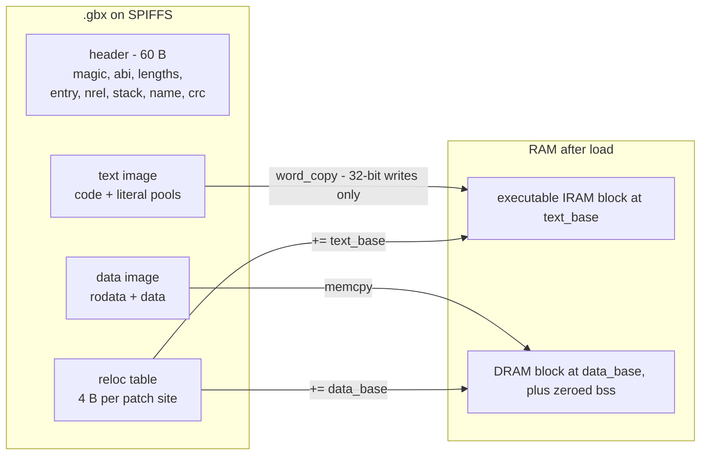

The two halves land in different kinds of memory and therefore at two unrelated
addresses. `.text` goes to the executable IRAM heap; `.rodata` goes to DRAM
with `.data` and `.bss`, **not** with the code, because IRAM on the ESP32 only
tolerates aligned 32-bit access and string and font tables get read a byte at a
time. Putting rodata in IRAM would look like it worked right up until the first
`LoadStoreError`.

That is also why the text image is copied with a word loop instead of `memcpy`.

Because there are two bases, a relocation entry has to say both *where* the
word to patch is and *which* base to add:

| bits | meaning |
|---|---|
| `0x0FFFFFFF` | offset of the 32-bit word to patch |
| `0x10000000` | the patch site is in the data image, not the text image |
| `0x20000000` | add `data_base` rather than `text_base` |

`mkguest.py` has already rewritten every patch site to hold a plain offset, so
the loader's inner loop is a bounds check and an add.

### The sequence

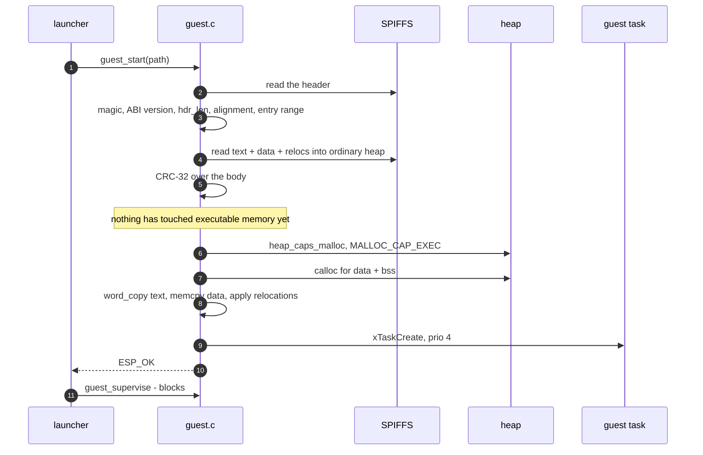

The body is validated in ordinary heap before a single byte reaches an
executable page. A corrupt or truncated image is rejected by CRC; one built
against a different ABI is rejected by version, with a log line that says to
rebuild it.

### The lifecycle

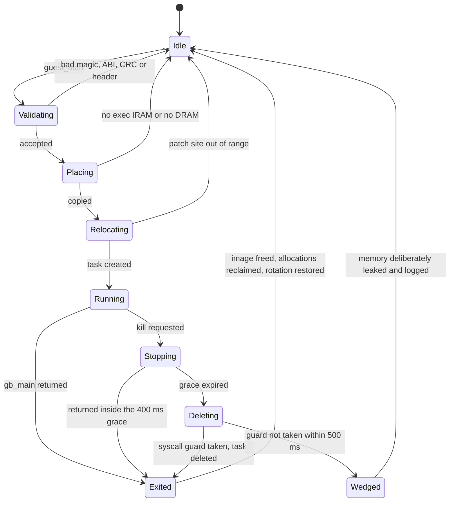

`Wedged` is the one case the OS refuses to force. Deleting a task that is
inside a syscall could mean deleting one that holds the SPI bus, and a
half-finished transaction takes the panel down with it. The loader gives up,
logs, and leaves that memory allocated - it also skips the rotation restore
there, because a second writer on the bus is worse than a sideways launcher.

Everything a guest allocated through `api->alloc` is tracked in a linked list
and reclaimed on the way out, kill or no kill.

---

## 6. The syscall boundary

Every entry in `gb_api_t` is a shim in `gapi.c`, never the OS function itself.

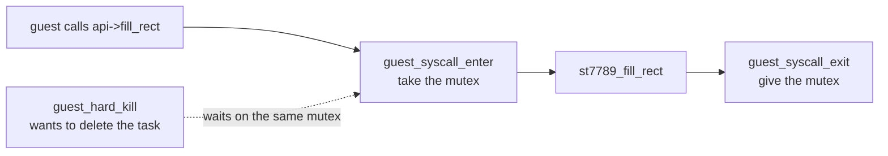

Short, hardware-touching calls are bracketed by the guard so the loader can
tell whether deletion is safe. Blocking calls - `wait_event`, `sleep_ms` - are
deliberately **not** guarded: holding the mutex while parked would make every
kill wait out the guest's frame timer.

`sleep_ms` is chopped into 50 ms slices and checks `should_stop` between them,
so a guest that asked to sleep for a minute still dies promptly.

The shims also give allocation tracking somewhere to live, and keep the table's
layout independent of how the OS spells its internals today.

### The one part of the table that is not a syscall

`api->gfx` is a pointer straight at a static table in `osgfx.c`, with no shim
and no guard at all - the software rasteriser guests draw their frames with.

That is not an exception to the rule above, it is the rule reaching its
boundary. The guard exists so that a kill never deletes a task holding the SPI
bus; every routine behind `api->gfx` writes into a `gb_surf_t` the *guest*
allocated and passes in by pointer, so there is no bus to hold, nothing to
track and no OS state to leave inconsistent. A guest deleted halfway through
drawing a circle leaves the OS holding nothing at all, because the OS was never
holding anything: not the pixels, not the clip, not even a pointer once the
call returned.

Putting the finished band on the glass is still `api->blit()`, which is a shim
and is guarded.

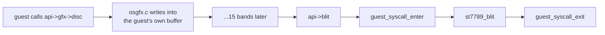

### The radio calls are unguarded, for the opposite reason

All four `wifi_*` entries skip the guard, and not because they are cheap.
`wifi_scan` can park for a second and a half. Holding the mutex across that
would make every kill wait out a sweep - precisely the case the guard exists to
keep quick.

What replaces it is that the radio's state lives in `oswifi.c` rather than on
the guest's stack. A guest deleted mid-scan leaves a scan running and nothing
else; `oswifi_release()` stops it, powers the radio down and reclaims its
~21 KB on the way out. And `oswifi_scan` checks `guest_stop_requested()`
between 25 ms slices, so the ordinary case is that the scan gives up on its own
before anything has to be killed.

`oswifi_release()` is called from `guest_supervise()` beside the rotation
restore, and skipped in the same case: a guest wedged inside a syscall is still
alive and may be inside the scan, and tearing the driver out from under it
would turn a leak into a crash.

---

## 7. ABI versioning

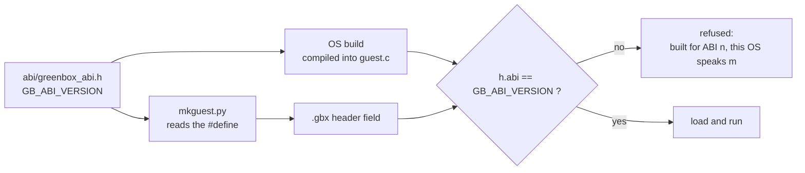

Any change to `gb_api_t`'s layout - **including appending at the end** - is
breaking and must bump the version. A guest built against a longer table would
read past the end of an older OS's table and call through whatever followed it.

`mkguest.py` reads the number out of the header rather than keeping its own
copy, because a second copy is one that can go stale, and the symptom of that
is "rebuild it" printed against a guest that was in fact just rebuilt.

There is one failure mode the version check cannot catch: adding a field to the
header *and* the table but forgetting to initialise it in `gapi.c`. Designated
initializers leave the omitted member NULL, both sides read the same version,
and the first guest to call it takes an illegal-instruction panic. New API
entries need a `gapi.c` shim in the same change.

---

## 8. Build pipeline

Two build systems, on purpose. Guests are *not* IDF components - that is what
keeps them kilobytes.

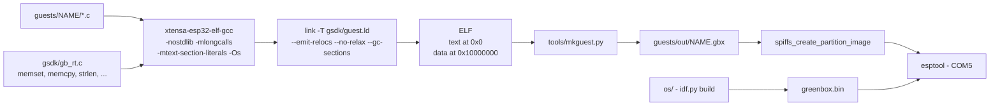

Three flags carry the whole scheme:

- **`-mlongcalls`** routes calls through literal pools, so nothing depends on
  how far apart two functions land.
- **`-mtext-section-literals`** keeps those pools inside `.text`, where an
  `l32r` still reaches them PC-relative after the loader moves the image.
- **`--no-relax`** because linker relaxation rewrites instructions *after* the
  relocations are recorded, and `--emit-relocs` is only trustworthy without it.

The two link addresses are far apart so that `mkguest.py` can classify any
address it finds by a range check. It reads the linker's own `R_XTENSA_32`
records to know which words are addresses at all - `0x00000010` is equally
plausible as a pointer and as the number sixteen, and only the linker knows
which it is. Everything else is a PC-relative slot relocation and is ignored,
because text moves as a unit.

Guests must be built **before** the OS: the OS build packs `guests/out/` into
the SPIFFS image. The commands are in
[TOOLCHAIN.md - build order](TOOLCHAIN.md#build-order); the flags above are
enforced by [`guests/build.ps1`](guests/build.ps1).

---

## 9. Where things are stored

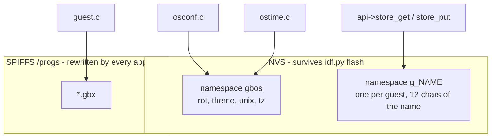

The split is not arbitrary. `/progs` is a SPIFFS image the build generates and
`idf.py flash` rewrites wholesale, so anything kept there is erased on every
reflash - which is exactly when a user has most recently set their preferences.
NVS is left alone by an app flash, so settings, the clock and guest key/value
blobs all live there.

NVS namespaces are capped at 15 characters, so a guest's namespace is `g_` plus
the first 12 characters of its name.

### Flash

| offset | size | partition | |
|---|---|---|---|
| `0x001000` | 28 K | bootloader | |
| `0x008000` | 4 K | partition table | |
| `0x009000` | 16 K | `nvs` | settings, clock, guest blobs |
| `0x00d000` | 8 K | `otadata` | |
| `0x00f000` | 4 K | `phy_init` | |
| `0x010000` | 1 M | `ota_0` | the OS |
| `0x110000` | 1 M | `ota_1` | reserved for rollback-safe OTA |
| `0x210000` | 512 K | `gslot` | reserved for the future XIP loader |
| `0x290000` | 1.4 M | `storage` | SPIFFS, `/progs` |

No `factory` partition: with only OTA slots present the bootloader falls back
to `ota_0` when `otadata` is blank, which is what a fresh flash produces.
`gslot` is type `data` deliberately - an `app`-type partition would tempt the
bootloader to try booting it.

---

## 10. Measured footprint

From `idf.py size` and the guest build, not estimates.

| | before the radio | with it |
|---|---|---|
| OS image | 236,697 B | 662,429 B |
| OS static IRAM | 58,742 B | 73,354 B |
| OS static DRAM | 13,836 B | 32,508 B |
| free heap at `app_main` | 282,584 B | 263,720 B |
| largest executable block | 110,592 B | 110,592 B |

The last row is the surprise, and it is good news. 14.6 KB more static IRAM
sounds like 14.6 KB off the pool a guest is loaded into, and it is not: the
executable heap on this chip comes out of the D/IRAM region at `0x3FFE4350`,
and the extra static IRAM came off the plain-IRAM tail at `0x40091E8C`
instead. The biggest guest that fits is the same size it was.

What the radio does cost is DRAM. 18.7 KB of it statically, before anything is
switched on, and about 21 KB more while it is actually running - measured from
the console: 262,768 B free with it down, 227,972 B with it up and `wherouter`
loaded. Switching it off returns all of it to within a kilobyte.

Linking WiFi in costs 425 KB of flash whether or not any program uses it, which
leaves `ota_0` 37% empty. That is the price of the radio being a library call
rather than a second firmware image.

| program | on disk | text -> IRAM | data -> DRAM | bss | relocs | RAM total |
|---|---|---|---|---|---|---|
| `clock` | 2,100 B | 1,544 | 296 | 40 | 50 | 1,880 B |
| `settings` | 2,688 B | 2,052 | 288 | 172 | 72 | 2,512 B |
| `wherouter` | 8,128 B | 6,716 | 556 | 2,540 | 199 | 9,812 B |
| `mandel` | 11,476 B | 9,836 | 536 | 7,468 | 261 | 17,840 B |
| `pinball` | 12,920 B | 8,444 | 2,968 | 7,856 | 362 | 19,268 B |
| `pacman` | 13,584 B | 11,072 | 836 | 8,868 | 404 | 20,776 B |
| `astro` | 13,704 B | 11,180 | 948 | 19,776 | 379 | 31,904 B |

Read straight out of `mkguest.py --info` on the current `guests/out/`, so it
moves when the guests are rebuilt. `pinball` and `astro` are smaller here than
the numbers quoted in [README - what the shared rasteriser cost](README.md#what-a-guest-draws-with),
because that table measures the change itself and this one measures what came
out of it.

For scale: the same clock built as a standalone IDF app is about 180 KB,
because it would ship its own copy of everything in the left-hand column of the
first diagram. `wherouter` drives the radio, keeps a table of twenty-four
networks and paints two full screens in 6.7 KB of code, because the 425 KB
underneath it is the OS's and it is paid for once.

---

## 11. What happens when it goes wrong

| failure | what the system does |
|---|---|
| `.gbx` corrupt or truncated | CRC-32 mismatch, refused before anything executable is written |
| built against another ABI | refused by version, log says rebuild it |
| relocation points outside the image | refused, offending index logged |
| not enough executable IRAM | refused, logs what was needed against the largest free block |
| guest returns normally | image freed, allocations reclaimed, rotation restored |
| guest ignores the stop flag | 400 ms grace, then the task is deleted |
| guest wedged inside a syscall | not deleted; memory leaked and logged, rotation left alone, reserved rows released, radio left up |
| radio will not start | `wifi_power` / `wifi_scan` answer false / -1; the guest says so and stays alive |
| guest exits with the radio up | `oswifi_release()` stops the scan, drops the watch and powers it down |
| guest crashes | it takes the whole system down - there is no memory protection on this chip, and none of this pretends otherwise |
| panel fails to init | logged, the OS runs headless; the console still works |
| SPIFFS mount fails | formatted and retried; an empty `/progs` shows as "no programs" |

The last row of the loader table is the honest limit of the design. Guests are
trusted code sharing one address space with the OS. The isolation here is
*lifecycle* isolation - a program can be started, stopped and reclaimed - not
memory isolation, which this silicon cannot provide.
